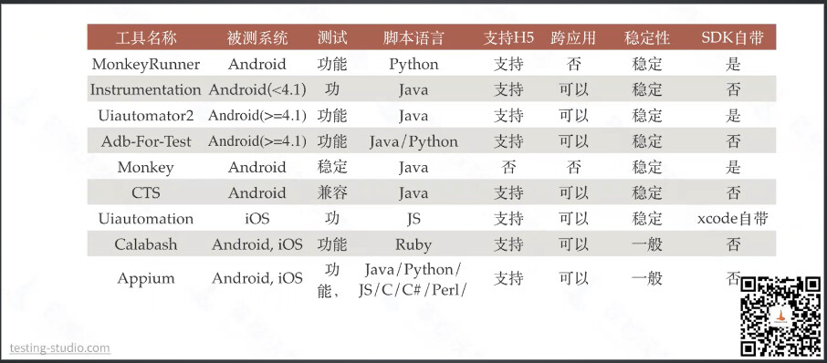

## 本框架简介
想放弃使用appium较为麻烦的配置，直接集成uiautomator2+Facebook-wda+playwright来分别实现对安卓、iOS、win、mac四端的UI自动化测试。
并且在执行app自动化测试时，不依赖mac电脑，直接在win上驱动iPhone进行UI自动化。

本框架的架构基于PO模式(PageObject)，使用三层模型:
- Driver层：完成对各端驱动常用方法的二次封装，如：安卓/ios/web的驱动管理；
- Page层：存放页面对象，通常一个UI界面封装一个对象类；
- Case层：调用各个页面对象类，组合业务逻辑、形成测试用例。

三层模型将Page层与Elements层存放在一起，各个页面对象文件同时包含当前页面中各个图标、按钮的resourceId、className等属性值，以便随时调用。

1. [common_tools](common_tools)：封装公共的工具，管理不同端的驱动。
2. [config](config)：配置文件，参数化。
3. [debug](debug)：一些随时删除新增的调试脚本。
4. [log](log)：执行日志。
5. [pages](pages)：Page层：存放页面对象，通常一个UI界面封装一个对象类，具体情况具体分析。所有page类需要直接继承[base_page.py](pages%2Fbase_page.py)。
6. [report_allure_temps](report_allure_temps)：测试报告的临时文件，每次执行测试会自动生成并删除先前的文件，一般不用管。
7. [reports](reports)：按日期自动生成的测试报告。
8. [scrcpy_path](scrcpy_path)：安卓截图工具
9. [screen_record](screen_record)：生成的录屏文件存放在此处，测试报告的录屏文件会从这个路径下读取。
10. [screenshot](screenshot)：提供给自动化测试人员的主动截图保存目录，会自动区分安卓还是iOS截图并分别保存。被动截图会自动附在测试报告文件里。
11. [test_case](test_case)：自动化测试用例目录，建议按被测模块划分。具体怎么写比较合理呢？还没想好···
12. [conftest.py](conftest.py)：
13. [pytest.ini](pytest.ini)：pytest配置文件
14. [requirements.txt](requirements.txt)：项目的相关依赖包
15. [run.py](run.py)：
16. [shared_v_name.txt](shared_v_name.txt)：录屏文件名，暂时先这样用。

## APP的UI自动化测试目的
APP自动化测试的主要目的包括但不限于以下几点：

1. **提高测试效率**：自动化测试可以相对快速执行大量的测试用例，显著减少人工测试所需的时间，尤其是在进行回归测试时，能够确保每次迭代或更新后，快速验证软件的==基本功能==未受影响。

2. **增强测试覆盖率**：通过自动化测试，可以轻松执行复杂和重复性的测试，覆盖更多的功能场景和边界条件，提高测试的广度。

3. **提升测试一致性与可重复性**：自动化测试脚本每次执行的步骤都是相同的，UI自动化测试可以模拟真实用户的手势操作，消除了人为操作的变异性，确保每次测试结果的一致性和可重复性。

4. **降低人力成本**：自动化测试减少了对人力资源的依赖，尤其是对于那些需要频繁执行的测试，可以节省大量的人力投入。

## APP的功能测试对象
在APP功能测试中，一个APP软件测试工程师通常不会直接负责硬件和固件的测试，但在这种摄像头APP的测试场景中，APP测试工程师可能需要与板端交流，以了解硬件和固件的功能，但这并不意味着APP测试工程师的测试对象就是板端。
在目前的情况下，我们app小组在测试摄像头app时，测试的对象可能至少包含了以下几个方面：

1. **APP软件本身**：
    - **功能测试**：确保APP能正确连接不同的摄像机，并显示对应的功能页面。测试工程师需要验证APP的各项功能是否按预期工作，例如设备的添加、视频流的显示、控制选项的可用性等。
    - **兼容性测试**：APP是否能够在不同型号的手机和操作系统上正常运行。
    - **用户界面交互测试**：检查APP的界面是否友好，功能是否易于使用，界面元素是否在不同设备上显示正常。
    - **性能测试**：暂未涉及该专项。

2. **摄像机（硬件+固件）**：
    - **功能测试**：确保不同型号的摄像机能够与APP无缝连接，测试每款摄像机是否都能展示其特有的能力集。确认摄像机固件提供的功能是否能够在APP上正确展示和操作。例如，某些摄像机可能支持特定的高级功能，测试这些功能有没有在APP中正确实现，==如控制摄像机转动、变焦、录像、拍照等功能==。
    - **性能测试**：测试摄像机在长时间运行、不同网络环境下的稳定性和性能，例如视频流的延迟、画质等。

所以，应该说**我们app小组的测试对象直接包括了APP软件本身，并间接涵盖部分摄像机（硬件和固件）的测试**。

## APP的UI自动化测试对象
在对这种摄像头APP进行UI自动化测试时，自动化测试工程师的测试对象主要是：
1. **APP软件的用户界面（UI）**
2. **用户与APP的交互流程**
尽管测试间接涉及到摄像机的功能验证，但自动化测试的重点在于确保APP的界面操作逻辑、响应和数据显示符合预期，特别是在不同场景和用户操作路径下。

自动化测试应该重点关注以下几个方面：

1. **关键路径流程自动化**：针对APP的核心功能，如摄像机的添加连接过程、远程配置、视频流预览播放、录制、截图、云台控制等操作，设计自动化测试脚本，确保这些高频使用场景的稳定性。

2. **界面元素交互验证**：确保用户能够通过UI访问所有功能、覆盖所有主要的导航路径。检查不同camera设备的按钮、滑块、输入框等UI元素的响应性，确保点击、触摸、输入等操作能正确触发相应的功能和反馈。

3. **动态UI元素&数据处理**：由于不同摄像机可能提供不同的功能集，测试需要确保在连接不同型号摄像机时，APP显示的UI元素和功能是正确的。

4. **异常处理和恢复能力**：模拟网络中断、摄像机断开连接等异常情况，验证APP的错误处理机制是否有效，以及在异常恢复后的功能表现。

5. **回归测试**：每次软件更新后，使用自动化测试脚本快速执行回归测试，确保新功能的添加或现有功能的修改没有引入新的问题。

## 如果从阶段来划分，针对什么做自动化？
### 测试阶段：
1.**新功能测试？**

2.**回归测试？**

3.**发布前验证？**

### 开发阶段：
**我们目前的现状，是否应该在开发阶段使用自动化介入？目前有必要吗？是否会引入别的风险？**

## RN一套代码开发出来Android、iOS、PC(win、Mac)，合理评估自动化至少应涵盖哪几个端？

## 主流UI测试框架基本对比

除此之外还有测试iOS的Facebook-wda，脚本语言为Python。
Macaca
airtest

## 框架选型

